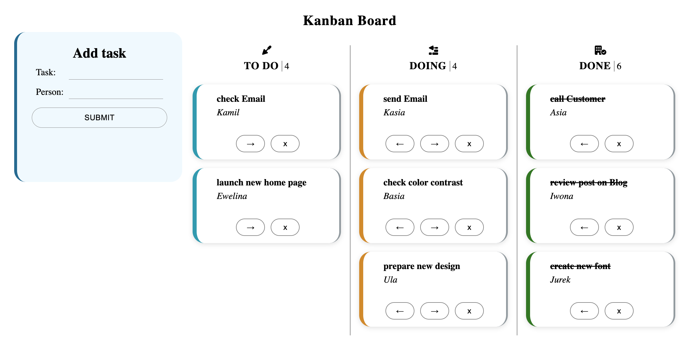
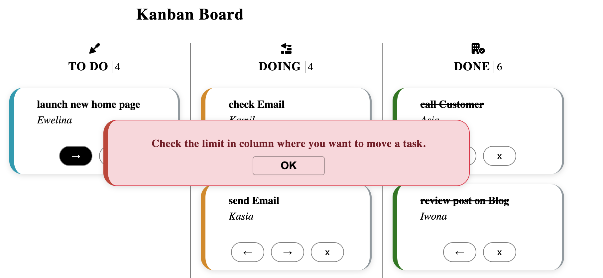

# Kanban Board - React

## About the project:
The aim of the project was to create application "Kanban Board" to manage tasks. My "Kanban Board" application has a form to add new tasks and consist with three columns:
* TO DO
* DOING
* DONE

Form features:
* user can add a new task by form
* when a task is added, user will see a confirmation, which disappear after 5 second
* every a new task is added to the first column "TODO"
* the first column has a limit (4 tasks), so if the limit will be achieved, user will see an alert, and a new task will not be added

Columns features:
* user can move tasks between columns using button with arrows
* every column has a limit, if tasks limit will be achieved, user will see an alert, and a task will not be moved
* user can remove task, before removing confirmation will be displaying

To storage a data I have used localStorage. After first rendering, application checking if there are any values in localStorage to loaded, if not, initial values are added to the localStorage.

```
useEffect(()=> {
        const data = window.localStorage.getItem("tasks"); // powtorzenie
        if(data){
            setTasks(JSON.parse(data));
        }
        else setTasks(tasks)
    },[])

```

Informations about default tasks (loaded when localStorage is empty) and columns are storage in json file, so it is easy to manage it, change the value like task limit in column or name of the column. Every changed is state is saving/updating in localStorage.

```
columns.json

[
    {
        "id":1,
        "columnName":"to do",
        "limit": 4,
        "class":"todo",
        "classIcon":"fa-solid fa-trowel"
    },

...
]
```

The application consist with 9 components:
1. ```<App/>``` - main component, there is a state, functions, which are transferred to the children components via Context API.
2. ```<Board/>``` - component which render a form and columns
3. ```<Columns/>``` - component which render ```<ColumnsItem/>``` and ```<Task/>``` components
4. ```<Form/>``` - component which render a form
5. ```<Confirmation/>``` - component which confirmation when task was added
6. ```<ConfirmDeleteTask>``` - component which render pop up when user want to remove a task
7. ```<Alert>``` - component which render an alert when the limit in columns was achieved

## How to see it
I have prepared a short video, to show how my application works. Please click the link below. You can check the screenshots, which are attached below, also.
* [Kanban Board - React | Ewelina Kopacz](https://www.awesomescreenshot.com/video/9768573?key=a13cc2551935f5b52d5250828a2df5aa
)

## Technologies:
* JavaScript
* React
* HTML
* CSS
* Desktop only version

## Solutions
When creating this project I had an opportunity :
* to learn what is it Context API - and how to use: ```<Provider/>``` and ```<Consumer/>```
* to learn what is it "props drilling" and how to avoid it
* to meet and use hooks such as:
    * useState()
    * useEffect()
    * useContext()
    * useCustom()
* to write a code with ESLint

### Development
I am going to develop application by adding additional functionalities such as:
* development a form: adding more fields like:
    * priority
    * deadline

### Project preview
Kanban Board


Alert


### Feel free to contact me:
* [Linkedin](https://www.linkedin.com/in/ewelina-kopacz-929559100/) - Ewelina Kopacz

### Sources:
* [Using localStorage with React Hooks](https://blog.logrocket.com/using-localstorage-react-hooks/)
* [Hooki React – useContext tutorial](https://love-coding.pl/hooki-react-usecontext-tutorial/)
* [Passing Data Between React Components — Parent, Children, Siblings](https://towardsdatascience.com/passing-data-between-react-components-parent-children-siblings-a64f89e24ecf)

### Thanks for project and support to Mateusz Bogolubow:
* Mentor i Trener Programowania JavaScript - [DevMentor](https://devmentor.pl/) - Mateusz Bogolubow